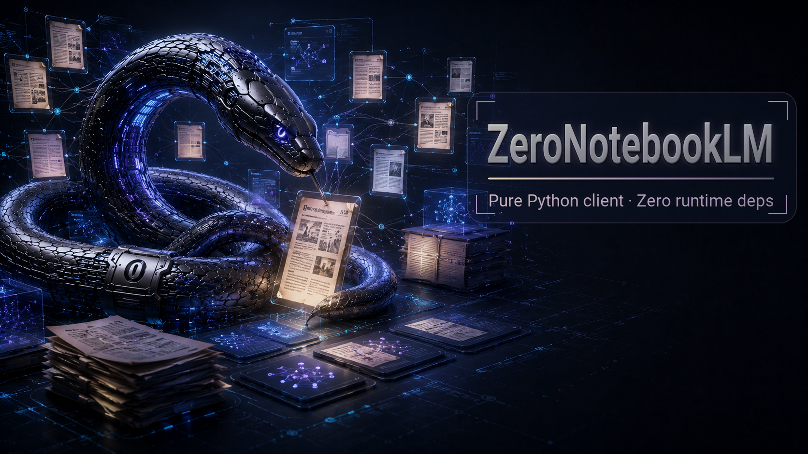
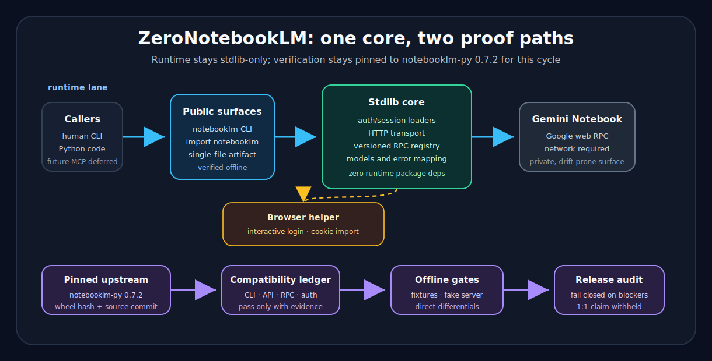

# ZeroNotebookLM

<p align="center">
  <strong>Stdlib-only Gemini Notebook client and CLI, targeting drop-in compatibility with <code>notebooklm-py</code> 0.7.2.</strong><br>
  Dependency-free installability, row-by-row parity evidence, and MCP deliberately deferred.
</p>

<p align="center">
  
  
  
  
  
</p>

<p align="center">
  
</p>

---

**ZeroNotebookLM** is a pure-Python implementation of the selected consumer automation surface for Gemini Notebook exposed by [`notebooklm-py`](https://github.com/teng-lin/notebooklm-py), with a tighter runtime constraint: no third-party Python packages at runtime.

[Google renamed NotebookLM to Gemini Notebook in July 2026](https://blog.google/innovation-and-ai/products/gemini-notebook/notebooklm-gemini-notebook/). This project retains its name and the pinned `notebooklm` package, API, and CLI identifiers for compatibility.

The repository provides an import-compatible `notebooklm` package, a `notebooklm` CLI, a local wheel builder, a single-file artifact, fixture-backed self-tests, and parity ledgers for the pinned upstream target. All 146 selected current-release auth rows pass; 49 browser/OS paths are explicit scope exclusions. Universal exact 1:1, production, and release claims remain withheld.

This is dependency-free installability, not offline Gemini Notebook. Live use still requires network access to Google and an authenticated session.

<p align="center">
  
</p>

## Status

| Area | Current state |
| --- | --- |
| Project stage | Public alpha; selected compatibility profile only |
| Upstream oracle | Pinned to `notebooklm-py==0.7.2` |
| Package version | `0.7.2`, mirroring the pinned upstream target rather than project maturity |
| Runtime dependencies | Zero third-party Python-package runtime dependencies; `pyproject.toml` declares `dependencies = []` |
| Python target | CPython 3.10, 3.11, 3.12, 3.13 |
| CLI/API/RPC parity | Offline gates pass for 90/90 CLI leaf rows, 9/9 API sub-client groups covering 108 behavior scenarios, and 5/5 RPC fixture rows |
| Auth parity | All 146 selected current-release auth rows pass; 49 paths are explicit current-release scope exclusions, never passes or N/A (25 Arc/Safari, four generic Opera GX Ubuntu, 10 pinned-reference-unexecutable Windows Chrome/Edge, and 10 `deferred_to_future_release` macOS Chromium/Vivaldi cookie paths) |
| MCP posture | No adapter is included; MCP is a separately scoped future release |
| Release posture | Public alpha; exact 1:1 and production readiness are not claimed |
| License posture | MIT; see `LICENSE` and `THIRD_PARTY_NOTICES.md` |

A parity row is a behavior entry in the compatibility ledger. A row passes only when the repo records evidence for matched behavior. The current ledger has 258 rows: 257 pass, zero open, and one not applicable across CLI, API, RPC, auth, offline, self-test, and MCP categories.

The target remains pinned to `notebooklm-py==0.7.2` until a separate re-pin cycle is explicitly approved. Any re-pin requires new compatibility evidence.

## What this is

ZeroNotebookLM is for developers who want a small, inspectable Gemini Notebook client they can vendor or install into constrained Python environments. It preserves the established `notebooklm` CLI and Python API shape while keeping the implementation stdlib-only.

Name map:

| Name | Meaning |
| --- | --- |
| ZeroNotebookLM | This project and repository |
| `zero-notebooklm` | Local distribution name |
| `notebooklm` | Import package and CLI entry point, kept compatible with the upstream client surface |
| `notebooklm_bare` / `singlefile/notebooklm_bare.py` | Generated vendorable artifact path |

## What this is not

- Not an official Google API.
- Not a fully offline Gemini Notebook replacement.
- The runtime does not depend on Playwright, Selenium, FastMCP, `httpx`, `requests`, `click`, `rich`, or `rookiepy`.
- Not a universal release-ready 1:1 replacement; current-release scope exclusions and other release gates remain.
- No MCP adapter is included; revisit it only as a separately approved future scope.

## Install and offline smoke test

From a checkout:

```sh
python -m pip install --no-build-isolation --no-deps .
notebooklm --help
python -m notebooklm.self_test --json
```

The self-test is offline. It validates packaged synthetic fixtures and parser/fake-RPC seams without touching home directories, browser stores, keychains, network state, or live Gemini Notebook accounts.

## Architecture

The runtime path is one shared core:

1. A human, script, CI job, or agent calls the `notebooklm` CLI or the import-compatible Python API.
2. The CLI/API forwards into the stdlib-only core.
3. The core owns auth/session/profile loading, HTTP transport, RPC request building, response decoding, models, and error mapping.
4. Live operation calls Gemini Notebook's private Google web RPC surface.
5. Offline checks use committed fixtures and fake servers.
6. Browser helpers are optional and limited to authentication and cookie import. Direct HTTP/RPC remains the default runtime model.
7. A future MCP adapter, if built, should be a policy layer over the same core, not a second Gemini Notebook implementation.

The verification lane is separate: pinned upstream artifacts feed compatibility manifests, row ledgers, fixture tests, fake-RPC tests, and release-candidate audits.

## Surfaces

| Surface | Current shape |
| --- | --- |
| CLI | `notebooklm ...` command tree; 90/90 CLI leaf rows pass from closed-system evidence |
| Python API | Import-compatible public package; 9/9 API sub-client groups pass from fixture/direct evidence |
| RPC layer | Versioned registry, encoders/decoders, fake-RPC fixture checks; 5/5 RPC fixture rows pass |
| Auth helpers | Storage state, browser-cookie, interactive login, profile, status, refresh, doctor, and logout behavior pass all 146 selected current-release rows; excluded and deferred paths are listed below |
| Local wheel | Built by `scripts/build_wheel.py` without the third-party `wheel` package |
| Single-file artifact | Generated at `singlefile/notebooklm_bare.py` by `scripts/build_singlefile.py` |
| MCP adapter | Deferred |

## Auth support matrix

| Lane | State |
| --- | --- |
| macOS Chrome interactive | Verified for row-specific auth evidence |
| macOS Edge interactive | Verified for row-specific auth evidence |
| macOS Chrome / Firefox / Safari / Brave / Edge / Opera / Opera GX cookie import | Verified for row-specific auth evidence |
| macOS Chromium interactive | Verified for row-specific auth evidence |
| macOS Chromium / Vivaldi cookie import | `deferred_to_future_release` current-release scope exclusions; never pass or N/A |
| macOS Arc | Outside the selected compatibility profile |
| Ubuntu in-profile rows | All pass; promoted interactive (15), Chrome cookie (5), and Opera GX profile-select (1) evidence |
| Ubuntu remaining rows | None in-profile; four generic Opera GX Ubuntu paths are excluded because the pinned reference cannot execute them |
| Windows Chrome / Chromium / Edge interactive | Verified for row-specific auth evidence |
| Windows Firefox / Brave / Chromium / Vivaldi / Opera / Opera GX cookie import | Verified for row-specific auth evidence |
| Windows Chrome / Edge cookie import | Zero succeeded on current schema-24 classic-DPAPI `v10` profiles. These 10 paths are excluded from strict parity—not marked pass or N/A—because pinned `notebooklm-py==0.7.2` / `rookiepy==0.5.6` cannot execute the same modern-profile paths. |
| Windows Safari / Arc | Outside the selected compatibility profile |

Auth evidence is deliberately conservative. The project does not read raw cookies into prompts, logs, fixtures, or README examples, and it does not promote a row without row-specific browser, OS, and path evidence.

## How parity is proven

Pinned upstream artifacts:

| Artifact | Value |
| --- | --- |
| Wheel | `notebooklm-py==0.7.2` |
| Wheel SHA-256 | `d850cfea2494732bc5f153406a9637c3ee5fe931d87901d101c026df2a6ecf65` |
| Source commit | `915b5321e1c1f411e23bd8265517be8740749e56` in `teng-lin/notebooklm-py` |

Committed compatibility artifacts:

```text
compat/notebooklm_py_0_7_2_oracle.json
compat/cli_surface.json
compat/python_api_surface.json
compat/auth_matrix.json
compat/auth_row_evidence.json
compat/cli_api_row_evidence.json
compat/dependency_graph.json
compat/parity_matrix.md
compat/parity_rows.json
compat/parity_evidence.json
compat/parity_normalization.md
```

Useful local gates:

```sh
python scripts/parity_readiness.py --json
python scripts/cli_api_parity_audit.py --json
python scripts/cli_behavior_parity_audit.py --json
python scripts/api_behavior_parity_audit.py --json
python scripts/rpc_drift_audit.py --json
python scripts/auth_row_promotion_audit.py --json
python scripts/release_candidate_audit.py --json --strict-alpha
```

`--strict-alpha` validates the reviewed selected profile and explicit exclusions.
The universal `--strict` gate still exits 77 and withholds exact 1:1 compatibility.

## Design principles

| Principle | Meaning here |
| --- | --- |
| Pinned upstream target | The oracle is `notebooklm-py==0.7.2`, not whatever upstream publishes next |
| Parity harness first | CLI, API, auth, RPC, and behavior rows are tracked before claims are made |
| Stdlib-only runtime | Runtime imports must resolve to Python stdlib or project-local modules under isolated checks |
| One core, many doors | CLI, Python API, local wheel, single-file artifact, and future MCP all share the same core |
| RPC drift containment | Private RPC identifiers and decoders sit behind a versioned registry |
| Auth as a release gate | Browser/session/profile behavior is a compatibility requirement, not later polish |
| Cloud reality stays visible | Local dependency-free code still calls Google's Gemini Notebook service for live work |
| MCP last | Any MCP adapter belongs in a separately approved future scope |

## Limits and non-goals

| Non-goal | Current position |
| --- | --- |
| Fully offline Gemini Notebook | Not possible for live operation; Gemini Notebook is a Google cloud service |
| Browser automation as the default runtime | Out of scope; direct stdlib HTTP/RPC is the core path |
| MCP-first design | Deferred |
| Safety gates inside the parity CLI | Not allowed if they change upstream behavior; use opt-in wrappers later |
| Official Google API claim | Not claimed; this targets private consumer web surfaces |
| Security-audited credential manager | Not claimed |
| Performance superiority | Not claimed until measured |
| Broad RAG replacement | Out of scope; this is a Gemini Notebook client compatibility project |

## Roadmap

Near-term work is about evidence, not new surface area:

1. Preserve row-specific evidence for the selected current-release auth profile; revisit deferred paths only in a future release scope.
2. Keep the pinned upstream oracle stable until a separate re-pin cycle is approved.
3. Keep the public-alpha gate green without weakening exact 1:1 claim boundaries.
4. Revisit deferred browser paths and MCP only in separately approved future scopes.

## Prior art and positioning

| Project | Relationship |
| --- | --- |
| [`teng-lin/notebooklm-py`](https://github.com/teng-lin/notebooklm-py) | Pinned upstream parity oracle |
| [`superdoccimo/notebooklm-tui`](https://github.com/superdoccimo/notebooklm-tui) | Pure-stdlib prior art for backup, restore, upload, and TUI workflows |
| [`jacob-bd/notebooklm-mcp-cli`](https://github.com/jacob-bd/notebooklm-mcp-cli) | CLI and MCP project; not the same stdlib parity target |
| [`khengyun/notebooklm-mcp`](https://github.com/khengyun/notebooklm-mcp) | MCP wrapper reference; not a bare-core parity implementation |

The gap ZeroNotebookLM tries to fill is narrower than "Gemini Notebook automation" in general: a stdlib-only, drop-in-compatible implementation of `notebooklm-py==0.7.2`'s CLI and Python API, backed by row-level evidence.

## Security notes

Gemini Notebook automation handles Google session material. Treat it accordingly.

Recommended defaults:

- Do not paste Google passwords, 2FA codes, recovery codes, raw cookies, OAuth tokens, or browser cookie values into issues, logs, prompts, CI output, or examples.
- Keep cookie/session files out of git.
- Redact notebook IDs, account emails, source titles, and artifact contents when filing bug reports if they reveal private work.
- Prefer disposable notebooks/accounts for live parity smoke tests.
- Keep browser debug ports bound to `127.0.0.1` when browser helpers are used.
- Treat all consumer Gemini Notebook RPCs as private and drift-prone.

See [SECURITY.md](SECURITY.md) for the current reporting and handling policy.

## Documentation map

- [SECURITY.md](SECURITY.md) — credential/session handling and vulnerability reporting
- [CHANGELOG.md](CHANGELOG.md) — repository history
- [LICENSE](LICENSE) — MIT project license
- [THIRD_PARTY_NOTICES.md](THIRD_PARTY_NOTICES.md) — pinned upstream attribution
- [auth-row-remaining.md](auth-row-remaining.md) — auth evidence history and current scope exclusions
- [docs/assets/zero-notebooklm-flow.svg](docs/assets/zero-notebooklm-flow.svg) — architecture visual

More docs should be added only when the corresponding artifacts exist. This README intentionally does not link to nonexistent API docs, configuration docs, or CI.

## License

ZeroNotebookLM is released under the [MIT License](LICENSE). See
[THIRD_PARTY_NOTICES.md](THIRD_PARTY_NOTICES.md) for pinned upstream attribution.

## Disclaimer

ZeroNotebookLM is not affiliated with, endorsed by, sponsored by, or supported by Google. Gemini Notebook (formerly NotebookLM) is a Google product. This project targets compatibility with an unofficial community client surface and may break when private Gemini Notebook web APIs change.
